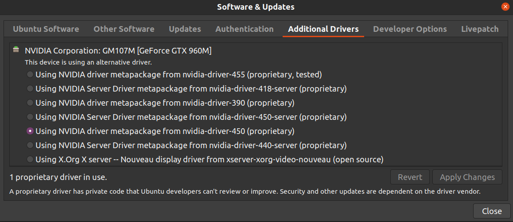
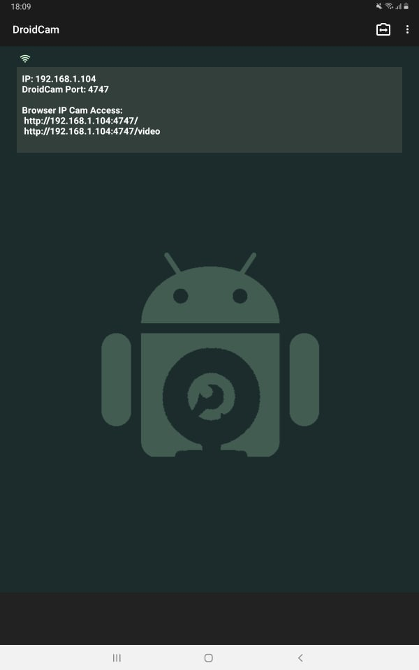
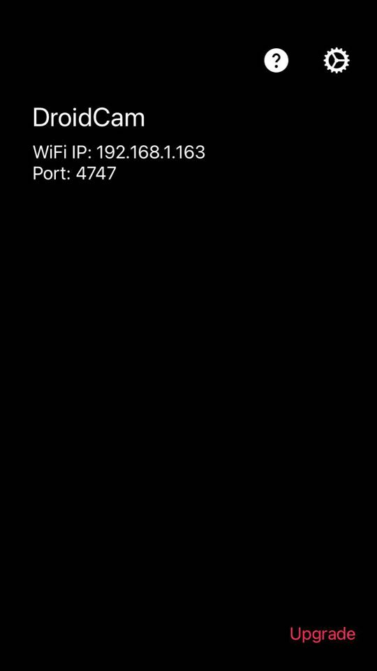
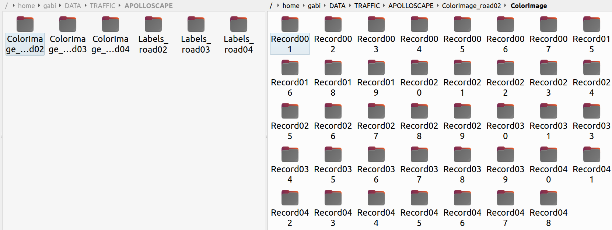
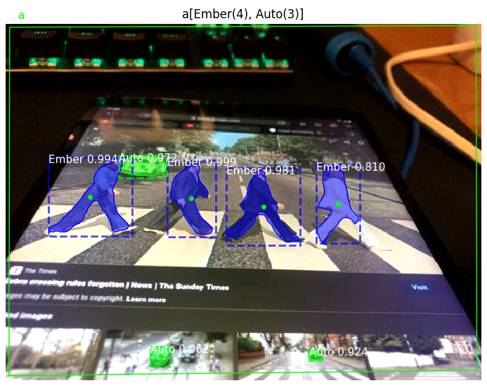
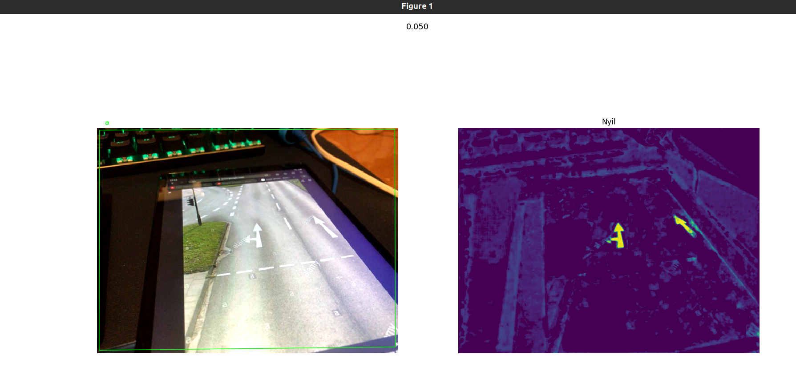
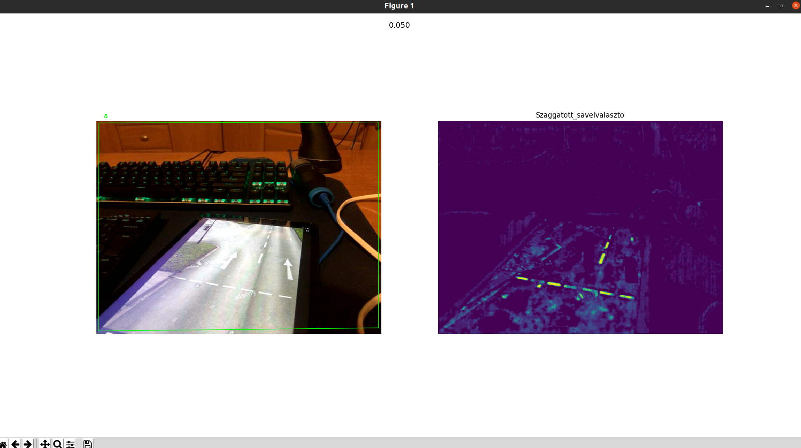
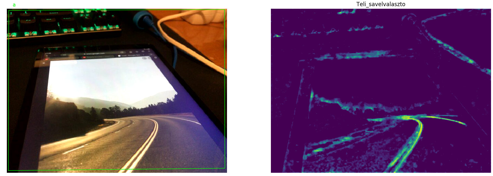
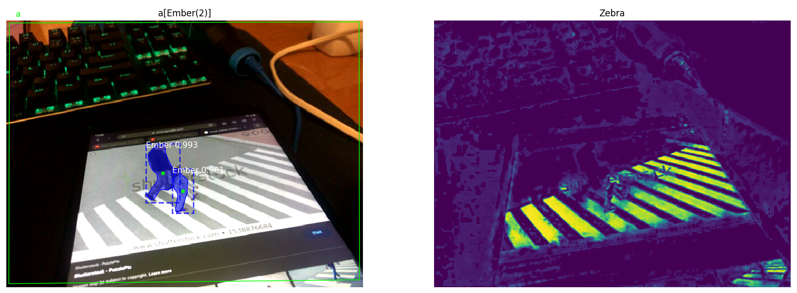

## Traffic
# Requiremets
* Ubuntu 20.04
* python 3.8 (default on Ubuntu 20.04)
* git with lfs (sudo apt-get install git git-lfs)
* CUDA-Enabled GeForce GPU
* nvidia-driver (proprietary) for eaxample:

# Optional requiremets
* Install Droidcam on:

|[Android](https://play.google.com/store/apps/details?id=com.dev47apps.droidcam&hl=en&gl=US)|[iOS](https://apps.apple.com/us/app/droidcam-wireless-webcam/id1510258102)|
|---|---|
|||
* Download the [Lane database](http://apolloscape.auto/lane_segmentation.html), for example:

# Usage
1. Install dependencies:
   1. git clone https://github.com/tasigabi97/traffic.git
   1. sudo /.../traffic/ci.py setup
   
1. [Rewrite the appropriate variables](https://github.com/tasigabi97/traffic/blob/326120e8104fe868ed6d29c1993ac8ecc1725da4/traffic/consts/independent.py#L5-L10)

1. Run main
   1. /.../traffic/ci.py main
   
# Screenshots

