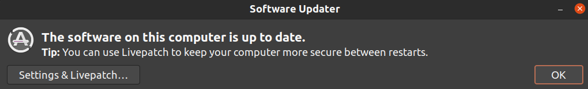

## Traffic
# Requirements
* Ubuntu 20.04 (with latest updates)
     * 
* python 3.8 (default on Ubuntu 20.04)
* pip  ```sudo apt install python3-pip```
* git with lfs ```sudo apt install git git-lfs```
* CUDA-Enabled GeForce GPU
* nvidia-driver (proprietary) for eaxample:
   * 
   * Restart the pc, because otherwise docker will not find the driver.

# Optional requiremets
* Install Droidcam on:

|[Android](https://play.google.com/store/apps/details?id=com.dev47apps.droidcam&hl=en&gl=US)|[iOS](https://apps.apple.com/us/app/droidcam-wireless-webcam/id1510258102)|
|---|---|
|||
* Download the [Lane database](http://apolloscape.auto/lane_segmentation.html), for example:


# Usage
1. Install dependencies:
   1. ```git clone https://github.com/tasigabi97/traffic.git```
   1. ```sudo /.../traffic/ci.py setup```
   
1. Rewrite the appropriate variables:```nano /.../traffic/traffic/consts/independent.py ```

1. Run main
   1. ```/.../traffic/ci.py main```
   
# Screenshots


